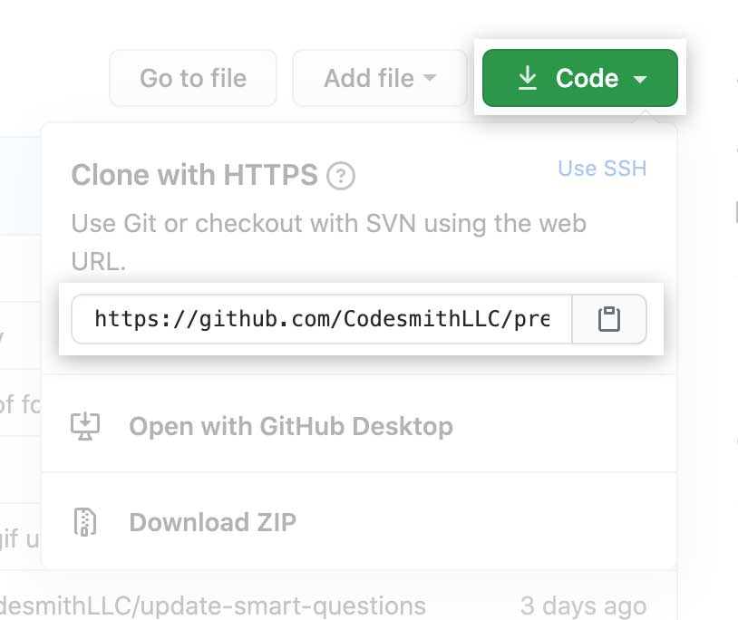
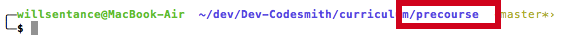
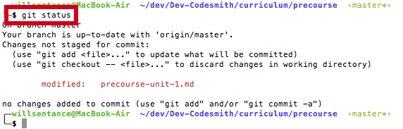
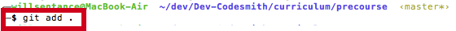
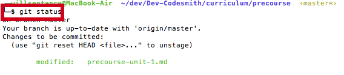
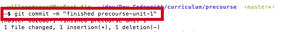
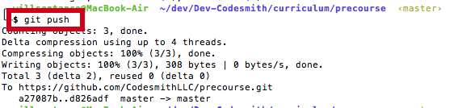
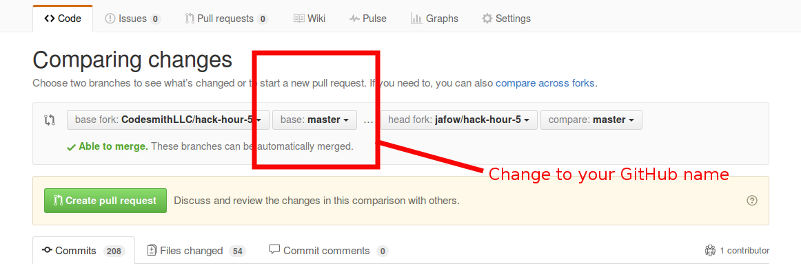
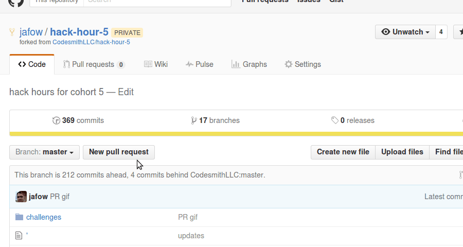

Read everything here closely :eyes:

GitHub is the software engineer's hub - where you'll find code written by your friends and team members and whole libraries like jQuery. What do we use GitHub for in our precourse?

## We're using GitHub for two purposes

1. As a hub for our Precourse instructions (they're saved in text documents - that end in .md). Each unit has its own .md file
2. As the place for you to save your progress to keep us updated

To update us on your progress is a little more complicated - follow these instructions step by step.

If you hit a block, consider the best search request to make on google and search for an answer (this is a core skill). If that does not work, you can post a message outlining your problem in your cohort's slack channel to request help.

## How do I get started?

1. Install git <http://git-scm.com/download/mac>
    - Windows users <https://git-scm.com/download/win> 
      - use the default settings when installing
      - for non-WSL users, this step will also set up Github Authentication
    - Mac users set up and install `brew` <http://brew.sh/> **HINT** if you ever need to install anything on a mac, use homebrew
      - then `brew update` and `brew install git`
    - Debian-based Linux and WSL users `sudo apt-get install git` 
      - If using WSL, git needs to be installed both on Windows and WSL

2. Fork this repo (this saves the instructions files to your own github profile)

  - click on fork button on the top right of the page <br>
  - click on your handle to fork to your own repo (that's the one with your name)

3. Clone the repo (this pulls down the instructions files to your own computer so you can edit them - you're going to add check marks to each instruction you complete)

  - copy and paste github url from the right side <br>
  - type in the following line into your command line and insert your copies url as shown below:
  ```
  git clone THE_URL_YOU_COPIED
  ```

For additional information on using Git and GitHub, watch this bonus video: <https://www.youtube.com/watch?v=tRTckrrCME4>

## GitHub Authentication

As of August 2021, GitHub requires the use of **tokens** to authenticate command-line GitHub operations (previously, you would have used your GitHub password). This means that you'll need to create a personal access token - and if you've previously authenticated command-line operations using a password, you'll need to replace your stored password with this token.

Please follow the below instructions to set up tokenized authentication:

**Mac Users**

1. Create a personal access token on Github. Follow the steps in [these docs](https://docs.github.com/en/github/authenticating-to-github/keeping-your-account-and-data-secure/creating-a-personal-access-token) from the very top of the page (“Creating a personal access token”) through step 9 (copying the token to your clipboard):
    - **When prompted to select scope, check the box marked “repo”. The others are not necessary.**
2. If you have *not* previously used GitHub through the command line on your machine, continue on to the "Using a token on the command line" instructions in the guide linked above. If you *have* previously used GitHub through the command line using password authentication, you'll want to instead follow step 3 below to replace it.
3. Delete github keychain “internet password” via the command line or via macOS Keychain Access GUI and replace the previous password with the access token generated in step 1. (See steps below)
    - To delete via macOS Keychain Access, follow the steps in [these docs](https://docs.github.com/en/get-started/getting-started-with-git/updating-credentials-from-the-macos-keychain) under “Updating your credentials via Keychain Access”. To delete via the command line, follow the steps under “Deleting your credentials via the command line”. If the command line deletion fails, try deleting the credentials from Keychain Access.
    - **Once you have successfully deleted your internet password, PASTE IN the token you copied to your clipboard in step 1.**
4. After you have successfully updated your token, you should be able to run git clone without errors (you may be prompted for your macOS system password when you run git clone).

**WSL Users**
<!-- For further info, see: https://docs.microsoft.com/en-us/windows/wsl/tutorials/wsl-git -->
1. Configure your name and email for Git
    ```
    git config --global user.name "Your Name"
    ```
    ```
    git config --global user.email "youremail@domain.com"
    ``` 
2. Allow WSL to use the Windows credential manager:
   ```
   git config --global credential.helper "/mnt/c/Program\ Files/Git/mingw64/libexec/git-core/git-credential-manager-core.exe"
   ```
3. The next time you run git clone, you will be prompted to log into Github via your web browser. Ensure you accept all popups from VSCode/WSL/Git in this process!
4. Once you've authenticated in the web browser, you should be able to run git clone without any errors

## What do I do when I am done with a unit?

When completed - you're going to commit and push your changes to your github. What does this mean?

Git is like Apple's time machine - it saves older versions of your work (even after you can no longer press undo) - but unlike Time machine that does this automatically, with Git, you have to tell it when you're ready to save a version for posterity - we use `git add` and `git commit` for this.

GitHub is a place online that you can 'push' up all your old versions so your friends and team mates (and the Codesmith team) can see them

That means you need to `git add` and `git commit` then `git push` your progress (whenever you feel you're proud of the number of sections you've checked off)

1. Navigate to where you downloaded ('cloned') the precourse instructions 

2. Check the status of your work by typing ```git status``` in the command line (terminal). This will check whether you have made any changes. Here we've modified precourse-unit-1.md 

3. Add your changes to 'prepare' them for saving a version using the command `git add`. Explicitly add your files one by one, you can do this by passing more than one file or folder to the `git add` command `git add file1.js file2.js` 
> The command `git add .` adds all changes in the current directory, and while it might seem helpful, it can easily cause major headaches for you. In other words: **DO NOT DO THIS**


4. Now check the status - your file you've updated should have turned green! 

5. Now we have to add a message using `git commit -m "[YOUR MESSAGE]" - your message should say how far you've got 

6. Now we're going to 'push' your code up to your github.com profile so we (the Codesmith team) can see it 

7. Last you'll create a pull request from your fork on GitHub to the branch with
   your GitHub username on Codesmith's repo.
   

   Here's a GIF:
   

8. :dancers: Celebrate now that you have successfully worked through the git procedure :dancers:

## Git tips!

- remember, you can always see your log by typing `git log`
- in these beginning stages always explicitly define what `remote` and what `branch` you are pushing to. When I `git push origin master` I am pushing to the `master` branch on the `origin` remote.
- We can always see all our remotes and their urls by typing `git remote -v`
- If you are working with the same repository folder between Windows, WSL, or a container, be sure to [set up consistent line endings](https://code.visualstudio.com/docs/remote/troubleshooting#_resolving-git-line-ending-issues-in-containers-resulting-in-many-modified-files)