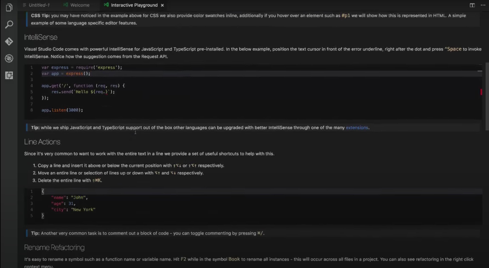

## Setting up your Dev Environment

First things first, you’ll need to set up your dev environment and install the software that you’ll be using during your time at Codesmith and beyond. We recommend following all of the below steps to fully set up your environment before you begin working. Although you won’t be using all of these things right now, they’ll be necessary to have during the program - it’s best to get a head start so that you’re able to come into the program with everything working ahead of time.

One important thing to note - we're going to cover a lot of ground here, and if you don't have previous experience using any of these technologies, most of this will be very unfamiliar to you. But don't be intimidated - that's OK! We don't expect you to fully understand everything at this point, and you'll get plenty of practice to become familiar with it all during the program.

### What OS should I be using?

Our curriculum is designed and maintained on Mac computers.  For that reason, we **STRONGLY** recommend a Mac for this program as our curriculum utilizes a lot of technology that is designed to work well with Mac's Unix based OS. If you choose to use a non-Mac, you'll need to install and learn Linux (such as WSL) on the machine of your choice. Please note that technology changes rapidly, and since we don't work in Windows or Linux, we don't know about changes on those platforms until one of our Residents has an issue.  We always do our best to help with these issues, but this can often take hours to debug (and away from time that should be spent coding).  While we always recommend purchasing the best computer you can afford, you do not need to go out and buy a brand new MacBook Pro.  Any working new or used Mac will do including MacBook and MacBook Air.

For instructions on environment setup, please follow whichever of the below links applies to you.

- [Environment setup for MacOS and Linux](https://github.com/CodesmithLLC/dev-environment-setup/blob/main/mac-os.md)
- [Environment setup for Windows OS](https://github.com/CodesmithLLC/dev-environment-setup/blob/main/windows-os.md)

### Download the Slack app

In the Codesmith immersive, we'll be using your cohort's Slack channel for all announcements and written communication between your instructors, program coordinators, and cohortmates. For the best experience, we *strongly* recommend [downloading the desktop app](https://slack.com/downloads) rather than using the browser version.

### You Need To Learn The Command Line

Still using the Windows Explorer or Mac Finder? These tools have a graphical interface (pictures of folders and files). However, many of the tools you'll use as a developer lack a nice graphical user interface (GUI). In order to use them, you'll need to be familiar with the command line. This is a management interface using only text. Don't worry! Once you get used to it, you'll find it makes your life much easier. You can use any resources you like. We recommend reading these.
- [What is the command line?](http://lifehacker.com/5633909/who-needs-a-mouse-learn-to-use-the-command-line-for-almost-anything)
- [Command line cheat sheet](https://github.com/ericdrowell/CheatSheetWorld/blob/master/src/programming/unix-linux.json)
- [Intro to Command Line](https://tutorial.djangogirls.org/en/intro_to_command_line/)

### You Need To Know How To Use GitHub

It is important that you get familiar with GitHub. For the precourse and throughout the program, you will access all challenges and submit your complete work through GitHub. The way we use GitHub is slightly different so make sure you read the ["GitHub.md"](https://github.com/CodesmithLLC/dev-environment-setup/blob/main/Github.md) file to get yourself familiar with the processes. Some knowledge of the command line will be necessary. Also, Github is very popular among well-known companies and knowing how to use it will undoubtedly be a great skill for you in the future.

In addition, here is a [video tutorial](https://youtu.be/SWYqp7iY_Tc).
Or if you prefer, go directly to the source and [read the docs](https://git-scm.com/docs)!
One other thing to note, git uses text editor called VIM which comes with it's own quirks. While not required, it is very helpful to be familiar with [basic commands](https://staff.washington.edu/rells/R110/). Or if you prefer online games <https://vim-adventures.com/>.

### Style guide

One of the signs of a great software developer is the ability to write clean, readable, and maintainable code. This means code that is indented appropriately, uses whitespace when necessary to make lines more readable, and adheres to certain consistent stylistic approaches and industry standard best practices. For instance, using `const` instead of `var` when a variable isn't modified after its creation allows the JavaScript engine to gain some performance benefits when executing your code, and it lets other developers reading your code know instantly, without any extra cognitive burden, what your intentions are for a variable. Other examples are not modifying function parameters unexpectedly, or making sure to place spaces in between operators such as `+`, `-`, `=`, etc.

Here at Codesmith we follow a custom styleguide based on [eslint recommended](https://eslint.org/docs/rules/). Down below in [Setting up VS Code](#Setting-up-VS-Code-(free)) you can find instructions for getting the eslint extension for VS Code. Once you have the extension, whenever you clone a new repository simply navigate to the directory from the terminal (in this case 'precourse-part-1') and run `npm install` to locally install the specific linting configuration - this way you'll get warnings in your text editor automatically when you don't follow the guidelines.

### Setting up a Code Editor

Code is just text - instructions for the computer written in plain text. Therefore we could write it in a simple text editor - but most people choose to use a more sophisticated text editor - VS Code has become a standard in software engineering. These "Integrated Development Environments" (IDEs) give us features like automatic highlighting of different JavaScript keywords, auto-complete of terms, automatic indentation of our code, and a rich plugin ecosystem that allows us to extend it's functionality in many ways.

#### Setting up VS Code (free)

Download VS Code:
<https://code.visualstudio.com/>

#### Recommended extensions
- [eslint](https://marketplace.visualstudio.com/items?itemName=dbaeumer.vscode-eslint): linting integration
- [code runner](https://marketplace.visualstudio.com/items?itemName=formulahendry.code-runner): for quickly running code
- [quokka](https://marketplace.visualstudio.com/items?itemName=WallabyJs.quokka-vscode): displays console.logs inline
- [live share](https://marketplace.visualstudio.com/items?itemName=MS-vsliveshare.vsliveshare): to easily collaborate in a shared workspace (we use this extension for pair programming in the remote immersive)
- [bracket pair colorizer](https://marketplace.visualstudio.com/items?itemName=CoenraadS.bracket-pair-colorizer-2): uniquely colorizes matching brackets

#### Useful VS Code documentation

Git integration in VS Code:
<https://code.visualstudio.com/docs/editor/versioncontrol>

Integrated terminal in VS Code:
<https://code.visualstudio.com/docs/editor/integrated-terminal>

Managing extensions for VS Code (includes themes):
<https://code.visualstudio.com/docs/editor/extension-gallery>

Launching VS Code from a terminal:
<https://code.visualstudio.com/docs/setup/mac>

<https://www.youtube.com/watch?v=SYRwSyjD8oI>
